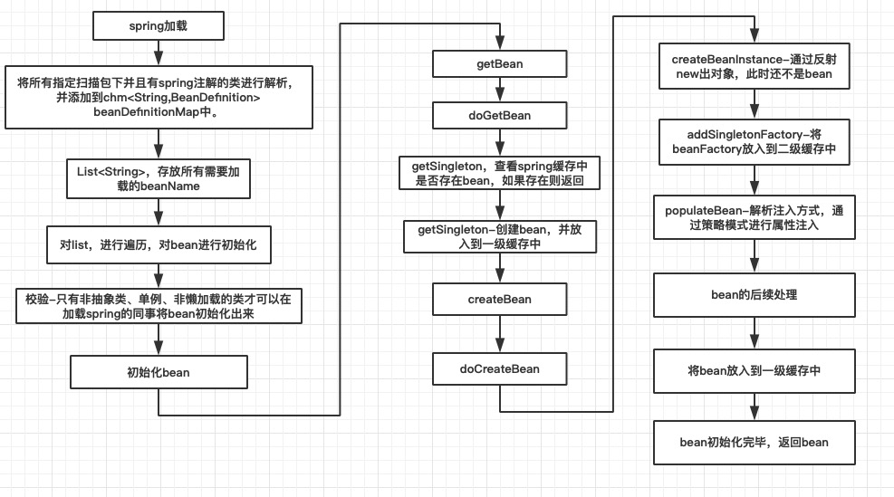
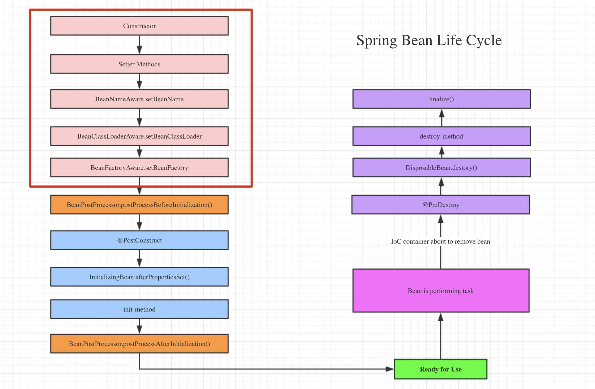

# 注解下的Spring IoC

IoC 是一种**通过描述来生成或者获取对象的技术**，而这个技术不是 Spring，甚至不是 Java 独有的。与传统的 new 关键字创建对象不同， Spring 是通过描述（ XML 文件或注解）来创建对象。

Spring 中把每 需要管理的对象称为 Spring Bean（简称 Bean ），而 Spring 管理这些 Bean 的容器，被我们称为 Spring IoC 容器（或者简称 IoC 容器）。 IoC 容器需要具备两个基本的功能：

- 通过描述管理 Bean ，包括发布和获取 Bean；
- 通过描述完成 Bean 之间的依赖关系，也就是依赖注入。

## 1. Spring IoC 容器的接口设计

Spring IoC 容器是一个管理 Bean 的容器，Spring 定义要求所有的 IoC 容器都需要实现顶级容器接口 `BeanFactory` 。

在接口`BeanFactory` 中，有多个 `getBean()` 方法，提供从 IoC 容器获取 Bean 的功能。`getBean()` 多个重载方法分别支持按类型、按名称获取 Bean ，这意味着 Spring IoC 容器允许我们按照类型或名称获取 Bean 。


`BeanFactory` 接口提供的功能比较基础，不能满足 Spring IoC 容器的需要，因此 Spring 在 `BeanFactory` 接口的基础上，设计了一个更为高级的接口 `ApplicationContext` 。


如上图，`ApplicationContext` 除了间接继承 `BeanFactory` 接口外，还扩展了消息国际接口 `MessageSource` 、环境可配置接口  `EnvironmentCapable` 、 应用事件发布接口 `ApplicationEventPublish` 和资源模式解析接口 `ResourcePatternResolver` 。

Spring Boot 中推荐使用注解装配 Bean 到 Spring IoC 容器中，因此不再涉及 XML 相关的 IoC 容器，我们主要关注基础注解的 IoC 容器—— `AnnotationConfigApplicationContext` 。

## 2. Spring IoC 容器装配简单对象

定义 Java 对象：

```java
@Component("user")
public class User {
    private Long id;
    private String username;
    private String password;
    
    /* setter and getter */
}
```

定义 Java 配置文件：

```java
/* 通过@Bean注解，将对应方法返回的POJO装配到IoC容器中 */
@Configuration
public class AppConfig {
    @Bean("user")
    public User user() {
        User user = new User();
        user.setId(1L);
        user.setUsername("user_name");
        user.setPassword("password");
        return user;
    }
}
```

通过 `@Bean` 注解将 Bean 注入到 Spring IoC 容器中，需要在配置文件 AppConfig 中建立对应的方法，非常不方便。因此，Spring 提供了批量扫描装配的方法，使用 `@Component` 和 `@ComponentScan` 注解。 `＠Component` 是标明哪个类被扫描进入 Spring IoC 容器，而`＠ComponentScan` 是标明采用何种策略去扫描装配 Bean 。

```java
@Component("user")
public class User {
    @Value("1L")
    private Long id;
    @Value("user_name")
    private String username;
    @Value("password")
    private String password;
    
    /* setter and getter */
}

@Configuration
@ComponentScan
public class AppConfig {
}
```

`@ComponentScan`源码如下所示：

```java
@Retention(RetentionPolicy.RUNTIME)
@Target({ElementType.TYPE})
@Documented
@Repeatable(ComponentScans.class)
public @interface ComponentScan {
    // 定义扫描的包
    @AliasFor("basePackages")
    String[] value() default {};
	// 定义扫描的包
    @AliasFor("value")
    String[] basePackages() default {};
	// 定义扫描的类
    Class<?>[] basePackageClasses() default {};
    
    ......
	
    // 当满足过滤器的条件时扫描
    ComponentScan.Filter[] includeFilters() default {};
	// 当不满足过滤器的条件时扫描
    ComponentScan.Filter[] excludeFilters() default {};
	// 是否延迟初始化
    boolean lazyInit() default false;
	
    ......
}
```

默认情况下，`@ComponentScan`只扫描注解所在类 AppConfig 的包及其子包中的 Bean ，如果目标 Bean 文件不在默认范围内，需要在注解中明确具体包路径。

## 3. 依赖注入

依赖注入解决的是 Bean 之间的依赖问题。比如：

```java
/*****************接口类*****************/
public interface Person {
    // 使用动物服务
    void service();
    // 设置动物
    void setAnimal(Animal animal);
}
public interface Animal {
    void use();
}
/*****************实现类*****************/
public class Businessman implements Person {
    @Autowired
    private Animal animal = null;
    
    @Override
    public void service() {
        this.animal.use();
    }
    
    @Override
    public void setAnimal(Animal animal) {
        this.animal = animal;
    }
}
```

通过使用 `@Autowired` 注解，Spring 就会根据属性的类型找到对应的 Bean 文件自动注入。

由于 `@Autowired` 是根据类型来匹配的，因此如果存在多个 Animal 的实现类， Spring IoC 就无法自主地判断注入哪一个 Bean 。这种情况下，我们需要使用 `@Primary` 和 `@Qualifier` 注解来明确注入对象。

- `@Primary` 注解是标注在实现类上的，表示存在多个实现类时优先注入。
- `@Qualifier` 注解则是和 `@Autowired` 注解搭配使用，其实是在 by type 的基础上添加了 by name 的限定条件。


`@Autowired` 现在不推荐直接用于属性，更推荐添加在 setter 方法上，实质是一样的。

由于对象实例化时，有一个类加载和实例化过程的影响，比如构造函数的调用是先于属性注入的，所以如果在构造函数中用到 Bean 的话，为了避免空指针异常，必须在构造时就注入依赖，这就是所谓的构造器注入。

```java
public class Man {
    /* 属性注入 */
    @Autowired
    private Animal animal = null;
    /* set注入 */
    @Autowired
    @Qualifier("cat")
    public void setAnimal(Animal animal) {
        this.animal = animal;
    }
    /* 构造注入 */
    @Autowired
    public Man(@Qualifier("cat") Animal animal) {
        this.animal = animal;
    }
}
```

## 4. 生命周期

有时候为了实现某些特异性的需求，我们需要自定义初始化或销毁 Bean 的过程，这就要求我们对 Bean 的生命周期有所了解。

Bean 的生命周期分为**定义**、**初始化**、**生存期**和**销毁**四个阶段。



Spring Bean 初始化过程中需要具体执行的方法：



在 Spring Bean `Ready for Use` 之前的起源当然是要调用构造器，所以 Constructor 毋庸置疑是创建 Spring Bean 的第一步

1. 通过 Setter 方法完成依赖注入，SDI （Setter Dependency Injection）
2. 依赖注入一旦结束， `BeanNameAware.setBeanName()` 会被调用，它设置该 bean 在 Bean Factory 中的名称
3. 接下来调用 `BeanClassLoaderAware.setBeanClassLoader()`，为 bean 实例**提供类加载器**，所有类都是要通过类加载器加载到上下文的
4.  `BeanFactoryAware.setBeanFactory()` 会被调用为 bean 实例提供其所拥有的 factory

在实际项目中，我们不可避免的要用到 Spring 容器本身提供的资源，这时候要让 Bean 主动意识到 Spring 容器的存在，才能调用 Spring 所提供的资源，这就是 Spring Aware 。

其实 Spring Aware 是 Spring 设计为**框架内部使用的**，若使用了，用户的 Bean 将会和 Spring 框架耦合，所以用户不应单独使用。

| Aware 子接口                   | 描述                                                         |
| ------------------------------ | ------------------------------------------------------------ |
| BeanNameAware                  | 获取容器中 Bean 的名称                                       |
| BeanFactoryAware               | 获取当前 BeanFactory ，这样可以调用容器的服务                |
| ApplicationContextAware        | 同上，在BeanFactory 和 ApplicationContext 的区别中已明确说明 |
| MessageSourceAware             | 获取 Message Source 相关文本信息                             |
| ApplicationEventPublisherAware | 发布事件                                                     |
| ResourceLoaderAware            | 获取资源加载器，这样获取外部资源文件                         |


