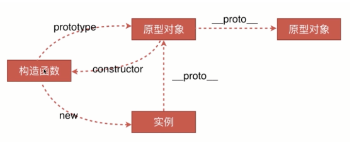

# JavaScript

## 1. 快速入门

### 1.1 JS代码的引入方式

```html
<!--内部引入-->
<script>
	// 内部直接写js代码
</script>

<!--外部引入-->
<!--type属性可以省略，src写相对路径或绝对路径-->
<script type="text/javascript" src="demo.js"></script>

<!--行内引入-->
<input type="button" οnclick="alert('行内引入')" value="button" name="button">
<a href="javascript:alert('我是a');">点我</a>
```

### 1.2 严格检查

```html
<script>
	'use strict';
    i = 10;		//undifine
    let i = 10;
</script>
```

`'use strict'` 声明代码在严格模式下执行，`'use strict'` 只有放在脚本或函数的开头时才会生效，放在其他位置无任何效果，同时 `'use strict'` 的作用域也与放置的位置有关，即只作用域当前所在的代码块。

**严格模式的限制：**

- 不允许使用未声明的变量
- 不允许删除对象、变量或函数
- 不允许变量重名
- 不允许使用八进制
- 不允许使用转义字符
- 不允许对只读类型赋值
- 不允许对一个使用getter方法读取的属性进行赋值
- 不允许删除一个不允许删除的属性
- 变量名不能使用 "eval"、"arguments"等字符串
- 禁止this关键字指向全局对象。

## 2. 数据类型

### 2.1 字符串

1. 字符串使用单引号或双引号包裹

2. 使用 `\` 转义

3. 反引号``可以写多行字符串

   ```javascript
   var msg =
       `hello
   	world
   	`;
   ```

4. 模板字符串

   ```javascript
   let name = 'zhangwl';
   
   let msg = `Hello, ${name}`;
   ```

5. 字符串长度

   ```javascript
   msg.length
   ```

6. 字符串不可变性

7. 大小写转换

   ```js
   msg.toUpperCase()
   msg.toLowerCase()
   ```

8. 通过元素获得下标索引

   ```js
   msg.indexOf('a')
   ```

9. 截取字符串

   ```js
   //前闭后开区间
   msg.substring(begin, end)
   ```

### 2.2 数组

**JS数组可以包含任意的数据类型**

1. 可变长度

   ```js
   arr.length
   ```

   通过给 arr.length 赋值可以改变数组长度

2. 通过元素获得下标索引

   ```js
   arr.indexOf()
   ```

3. 数组切片截取，返回一个新数组

   ```js
   arr.slice(begin, end)
   ```

4. 元素插入弹出

   ```js
   arr.push();    //压入到尾部
   arr.pop();	   //从尾部弹出
   
   arr.unshift(); //压入到头部
   arr.shift();   //从头部弹出
   ```

5. 排序 

6. `

7. `arr.soft()`

8. 元素反转 `arr.reverse()`

9. 数组拼接 `arr.concat()`

10. 连接符 `join()` ，打印拼接数组，使用指定的字符串连接起来

    ``` js
    --> (3) ['C', 'B', 'A']
    arr.join('-')
    --> 'C-B-A'
    ```

11. 多维数组

    ```js
    arr = [[1, 2], [3, 4], ['5', '6']];
    console.log(arr[1][1]);
    --> 1
    ```

### 2.3 对象

若干个键值对组成

```js
var 对象名 = {
    属性名: 属性值,
    属性名: 属性值,
    属性名: 属性值
}

var person = {
    name: "zhangwenlong",
    age: 18,
    email: "lon@mail.ustc.edu.cn",
    score: 0
}
```

1. 对象赋值

   ```js
   person.name = "lon";
   person.name;
   --> "lon"
   ```

2. 使用一个不存在的对象属性，不会报错！只会显示undefined

   ```js
   person.school;
   --> undefined
   ```

3. 动态删减属性，通过 delete 删除对象属性

   ```js
   delete person.name;
   --> true
   person;
   --> {age: 18, email: "lon@mail.ustc.edu.cn", score: 0}
   ```

4. 动态的添加属性，直接给新的属性添加值即可

   ```js
   person.school = 'ustc';
   --> 'ustc'
   person;
   --> {name: "zhangwenlong", age: 18, email: "lon@mail.ustc.edu.cn", score: 0, school: "ustc"}
   ```

5. 判断某一属性是否在对象中

   ```js
   'age' in person;
   --> true
   // 也可以查看继承来的属性
   'toString' in person;
   --> true
   ```

   此处有个需要注意的点，**JS中对象的属性都是字符串，而属性值则可以是任意类型。**

6. 判断一个属性是否是这个对象自身拥有的 `hasOwnProperty()`

   ```js
   person.hasOwnProperty('toString');
   --> false
   person.hasOwnProperty('age');
   --> true
   ```

## 3. 流程控制

`if-else` 、 `while` 及 `for` 与 Java中无区别

**重点在于 `foreach` 循环**：

```js
var arr = [12, 23, 15, 32, 54];
// 第一种操作，这里的num是arr的索引，从0到arr.length - 1
for (var index in arr) {
    console.log(arr[index]);
}
// 第二种操作，类似其他语言里的foreach操作
for (var num of arr) {
    console.log(num);
}
// 第三种操作，通过数组的foreach方法实现，其实这是通过回调函数的方法实现数组遍历
// 		回调函数的三个参数，依次是当前元素值、元素索引和所在数组
arr.forEach(function(value, index, arr) {
    console.log(`${arr} >>>> ${index}---${value}`);
});
```

## 4. 集合

> ES6 的新特性

### 4.1 Map

```js
var map = new Map([['tom', 100], ['jack', 89], ['jerry', 98]]);
console.log(map.get('tom'));
--> 100
map.set('admin', 101);
console.log(map);
--> Map(4) {"tom" => 100, "jack" => 89, "jerry" => 98, "admin" => 101}
map.delete('admin');
--> true
console.log(map);
--> Map(3) {"tom" => 100, "jack" => 89, "jerry" => 98}
```

### 4.2 Set

无序不重复的集合

```js
var set = new Set([3, 1, 1, 1]);
console.log(set);
--> Set(2) {3, 1}
set.add(2);
--> Set(3) {3, 1, 2}
```

### 4.3 iterator

如前面`3. 流程控制`中描述的，Map 和 Set 也支持 `for-of` 遍历方式。

## 5. 函数

### 5.1 函数定义

方法和函数本质上是一样的，方法是面向对象语言里的概念，对象包括属性和方法，而函数则更多出现在C/C++、Python等支持其他编程范式（如面向过程）的语言中，所以函数的的概念更宽泛。

> 定义方式一

```js
// 绝对值函数
function abs(x) {
    return x >= 0 ? x : -x;
}
// 一旦执行到return语句，代表函数结束，返回结果
// 如果没有执行到return语句，函数执行完也会返回结果undefined
```

> 定义方式二

```js
// 绝对值函数
var abs = function(x) {
    return x >= 0 ? x : -x;
}
// function(x){...}可以理解为一个匿名函数，将函数指针返回给abs，就可以类似C那样通过函数指针调用函数
```

> 调用参数

JavaScript 可以传递任意参数，也可以不传递参数。

由于参数没有类型限制，任意类型数据都可以往里面传，所以需要在函数开头处理参数类型，比如

```js
function abs(x) {
    if (typeof x !== 'number') {
        throw "Not a Number!";
    }
    return x >= 0 ? x : -x;
}
```

> arguments

==arguments== 是一个 JS 自带的数组变量，可以通过遍历它，获得函数全部参数

```js
function abs(x) {
    for (let arg of arguments) {
        console.log(arg);
    }
    return x >= 0 ? x : -x;
}
```

> ES6新特性——rest
>
> 获取已定义的参数之外的其他所有参数

```js
function f(a, b, ...rest) {
    console.log(a);
    console.log(b);
    console.log(rest);
}

f(1, 2, 3, 4, 5);
--> 1
--> 2
--> (3) [3, 4, 5]
```

在这里，未被定义的多余参数将会统一存放到 rest 数组中，其中 rest 并非是定义的关键字，而是一种默认写法，将 rest 改成其他变量名字不影响操作。

### 5.2 变量作用域

在JS中，var 定义的变量是有作用域的，比如下面，在函数体内声明的变量，在函数体外不可使用（闭包）

```js
function f() {
    var x = 1;
    x += 1;
}
x = x + 2;
--> Uncaught ReferenceError: x is not defined
```

> 提升变量的作用域

```js
function f() {
    var x = "x" + y;
    console.log(x);
    var y = 'y';
}

--> xundefined
```

注意，此时没有提示 `y is not defined` ，而只是打印了 `xundefined`，是因为 JS 执行引擎将作用域的所有变量声明提前了，即实际执行代码如下

```js
function f() {
    var x, y;
    x = "x" + y;
    console.log(x);
    y = 'y';
}
```

所以，代码规范应该尽量将作用域内的所有变量声明都放在作用域的开始位置，不要乱放，便于代码维护。

> 全局函数

```js
// 全局变量
var x = 1;

function f() {
    console.log(x);
}
f();
console.log(x);

--> 1
--> 1
```

全局对象 window，所有的全局变量和全局函数都绑定在 window 对象上。

JavaScript 实际上只有一个全局作用域，任何变量（包括函数）如果在本层作用域内没有找到，就会向外查找，一直查找到全局作用域。如果在全局作用域中也找不到，报错 ==ReferenceError== 。

> 规范：由于所有全局变量都会绑定到 window 上，如果不同的 js 文件使用了相同的全局变量，使用时会发生冲突。**解决办法类似于 C++ 的命名空间，定义一个唯一全局变量作为命名空间，其他所有全局变量皆作为该命名空间的属性存在。**

```js
// 定义唯一全局变量
var lon = {};

// 定义需要的全局变量
lon.name = 'zwl';
lon.abs = function(x) {
    return x >= 0 ? x : -x;
}
```

> 局部作用域 let

典型的，在 for 语句中，var 定义的变量在出了作用域之后仍然可以使用

```js
function f() {
    for (var i = 0; i < 10; ++i) {
        console.log(i);
    }
    console.log(i + 1);    // --> 11
}
```

可以看到，var 只支持函数作用域，而不支持块级作用域，而 let 改进了这一点。

```js
function f() {
    for (let i = 0; i < 10; ++i) {
        console.log(i);
    }
    console.log(i + 1);    // Uncaught i is not defined
}
```

除去作用域的改进之外，let 比 var 还有以下改进：

1.  let 不支持变量提升，也就是说 let 变量存在暂时性死区
2.  let 变量不能重复声明

> 常量 const

在 ES6 之前，==通过规范来实现变量==，即变量名为全大写的方式区别常量和变量。

ES6 之后，通过 const 关键字声明常量，声明的常量不允许被修改

```js
const PI = 3.14;
PI = 3;
--> Uncaught TypeError: Assignment to constant variable.
```

### 5.3 方法

```js
var person = {
	name: "lon",
    score: 100,
    // 方法
    getScore: function() {
        return this.score;
    }
}
// 调用方法，需要加上括号
person.getScore();
```

还有一种写法：

```js
function getScore() {
    return this.score;
}
var person = {
	name: "lon",
    score: 100,
    // 方法
    getScore: getScore;
}

person.getScore();
--> 100
getScore();
--> Uncaught TypeError: Cannot read property 'score' of undefined
```

直接调用 `getScore()` ，this 是无法指向 person 对象的，它默认指向调用它的那个对象。

> apply

在 JS 中可以明确指定 this 的指向

```js
function getScore() {
    return this.score;
}
var person = {
	name: "lon",
    score: 100,
    // 方法
    getScore: getScore
}

// 明确了this指向person，无参数
getScore.apply(person, []);
```

## 6. 特殊对象

> 标准对象

- number
- boolean
- string
- object
- function
- undefined

### 6.1 Date

**基本使用：**

```js
var now = new Date();	// now获取当前时间
--> Tue Jul 27 2021 22:19:56 GMT+0800 (中国标准时间)
now.getFullYear();	//年
--> 2021
now.getMonth();	    //月
--> 6
now.getDate();      //日
--> 27
now.getDay();       //星期几
--> 2
now.getHours();     //时
--> 22
now.getMinutes();   //分
--> 19
now.getSeconds();   //秒
--> 56

now.getTime();      //获取时间戳
--> 1627395596590

console.log(new Date(1627395596590));  // 时间戳转换为Date
--> Tue Jul 27 2021 22:19:56 GMT+0800 (中国标准时间)
```

**时间转换：**

```js
var t = new Date(1627395596590);    //时间戳转Date
--> Tue Jul 27 2021 22:19:56 GMT+0800 (中国标准时间)
t.toLocaleString();		// 转换为本地时区字符串
--> "2021/7/27 下午10:19:56"
t.toGMTString();        // 转换成GMT时间字符串
--> "Tue, 27 Jul 2021 14:19:56 GMT"
```

### 6.2 JSON

> JSON (JavaScript Object Notation, JS对象简称) 是一种轻量级的数据交换格式。

在 JavaScript 中，一切皆为对象，任何 JS 支持的类型都可以用 JSON 来表示

格式：

- 对象使用{}
- 数组使用[]
- 所有的键值对都是 `Key: Value`

```js
// 对象转换为 JSON 字符串
var jsonPerson = JSON.stringify(person);	// person对象序列化为json
console.log(jsonPerson);
--> '{"name":"lon","score":100}'
var obj = JSON.parse('{"name":"lon","score":100}');    // 反序列化json，生成对应JS对象
consloe.log(obj);
--> {name: "lon", score: 100}
```

### 6.3 Ajax

- 原生的 JS 写法，xhr 异步请求
- jQuery 封装好的方法，$("#name").ajax("")
- axios 请求

## 7. 面向对象编程

其他面向对象语言：

- 类：模板
- 对象：具体的实例

而，传统的 JavaScript 中取消了模板和实例的区分，也就是说只存在实例对象，而不存在类模板。

> **原型继承：**

```js
var person = {
    name: '张三',
    age: 18,
    sleep: function() {
        return `${this.name} is sleeping...`;
    }
}

var student = {
    name: '李四',
    age: 22,
    score: 12
}
student.__proto__ = person;      //明确student的原型是person，相当于student继承了person
console.log(student.sleep());    //因此student可以调用person的方法
--> 李四 is sleeping...
```

> **class 继承：**

ES6 引入了 class 关键字

```js
class Student {
    constructor(name) {
        this.name = name;
    }
    hello() {
        alert('hello');
    }
}

// 实例化class
var stu1 = new Student("张三");
var stu2 = new Student("李四");
stu1.hello();

// 继承
class Junior extends Student {
    constructor(name, grade) {
        super(name);
        this.grade = grade;
    }
}
var Junior = new Junior("王老五", 3);
```

> **原型链：**



## 8. 操作 BOM （重点）

> window

window 对象代表浏览器窗口，可以通过它查询浏览器的一些属性

```js
window.alert(1);     //浏览器弹窗
--> undifined
window.innerHeight;
--> 602
window.innerWidth;
--> 726
window.outerHeight;
--> 672
window.outerWidth;
--> 1280
```

> Navigator

Navigator 封装了浏览器的信息

```js
navigator.appName
--> "Netscape"
navigator.appVersion;
--> "5.0 (Windows NT 10.0; Win64; x64) AppleWebKit/537.36 (KHTML, like Gecko) Chrome/92.0.4515.107 Safari/537.36 Edg/92.0.902.55"
navigator.platform;
--> "Win32"
```

大多数时候，不建议使用 `navigator` 对象进行判断，因为会被人为修改。

> screen

代表屏幕尺寸

```js
screen.height;
--> 720
screen.width;
--> 1280
```

> **location（重要）**

location 代表当前页面的 URL 信息。

```js
// Location内容
Location {
    ......
    host: "cn.bing.com"
    hostname: "cn.bing.com"
    href: "https://cn.bing.com/search?q=Netscape&qs=n&form=QBRE&sp=-1&pq=netscape&sc=8-8&sk=&cvid=E2AE4C48AC6A490DBD82F73222CBC70E",
    origin: "https://cn.bing.com",
    pathname: "/search",
    port: "",
    protocol: "https:",
    ......
}

// 跳转到新地址
location.assign('https://www.baidu.com');
```

> document

document，代表当前页面，HTML DOM 文档树

可以获取具体的 DOM 结点

```html
<dl id="app">
    <dt>Java</dt>
    <dd>JavaSE</dd>
    <dd>JavaEE</dd>
    <dd>JavaME</dd>
</dl>

<script>
    'use strict';
    var dl = document.getElementById('app');
    console.log(dl);
</script>
```

获取 cookie

```js
document.cookie;
--> "SRCHD=AF=NOFORM; SRCHUID=V=2&GUID=C9D49B4B4269431EB85B68B334FE2861&dmnchg=1; ANON=A=952A6E50AF5DF19D5D7F6ED7FFFFFFFF; MUID=1B031F19B0FB6BD600DC0F72B1CB6A3F; WLS=C=e8e5121eeb96f37f&N=Wenlong; _SS=SID=3C72445169F366A6299254D368B967D8&bIm=50:; ABDEF=V=13&ABDV=13&MRB=1627459699507&MRNB=0; SRCHUSR=DOB=20210629&T=1627459681000; ipv6=hit=1627464218253&t=4; SRCHHPGUSR=SRCHLANGV2=zh-Hans&BZA=0&BRW=M&BRH=S&CW=1280&CH=602&SW=1280&SH=720&DPR=1.25&UTC=480&DM=1&HV=1627460626&SRCHLANG=zh-Hans&EXLTT=31&THEME=1&PR=1.25; SNRHOP=I=&TS=; _U=1-Dmo6frwigQuwaKGudJFP1gpCfHD-m9l0CsWut7cPsHU--kCz1U8AiqV2DJQ4Xa8SxrW05QMgdN32vwim2zzLc0YdikPCROH4P5wD-_XRmQ7rayjAz0ZfAWwOYRouQ5Z8EfGDOPzh-f8uhs0HNSzxPFjG_j95kZcAX8qbWdtrYXkA5GIRhB7x3ZoCz7eDohC"
```

劫持 cookie 就是利用 document.cookie 实现的

服务器端可以设置 cookie: httpOnly 保护 cookie。

> history

代表浏览器的历史记录

```js
history.forward();    // 前进
history.back();       // 后退
```

## 9. 操作表单

> 表单是什么

- 文本框  text
- 下拉选择框  select
- 单选框  radio
- 多选框  checkbox
- 隐藏域  hidden
- 密码框  password
- ......

> 表单的目的

提交信息

> 获得要提交的信息

```html
<form action="post">
    <p>
        <span>用户名：</span>
        <input type="text" name="username" id="username">
    </p>
    <!-- 多选框的值，就是定义好的value -->
    <p>
        <span>性别：</span>
        <input type="radio" name="sex" id="boy"> 男
        <input type="radio" name="sex" id="girl"> 女
    </p>
</form>
<script>
    'use strict';
    var inputText = document.getElementById('username');
    var boyRadio = document.getElementById('boy');
    var girlRadio = document.getElementById('girl');

    // 获取输入框的值
    console.log(inputText.value);
    // 修改输入框的值
    inputText.value = 'default';

    // 单选框通过 check 检查某一项是否被选中
    console.log(boyRadio.checked);
    console.log(girlRadio.checked);
</script>
```

> 提交表单

```html
<script src="https://cdn.bootcss.com/blueimp-md5/2.10.0/js/md5.min.js"></script>

<!-- 表单绑定提交事件 -->
<!-- onsubmit 绑定一个提交检测的函数， true false -->
<form action="https://www.baidu.com/" method="POST" onsubmit="return abc()">
    <p>
        <span>用户名：</span>
        <input type="text" name="username" id="username">
    </p>
    <p>
        <span>密  码：</span>
        <input type="password" id="input-password">
    </p>
    <input type="hidden" name="password" id="md5-password">
    <!-- 按键点击绑定事件 -->
    <button type="submit">提交</button>
</form>

<script>
    'use strict';
    function abc() {
        var 
        uname = document.getElementById('username'),
            pwd = document.getElementById('input-password'),
            md5pwd = document.getElementById('md5-password');

        console.log(uname.value);
        md5pwd.value = md5(pwd.value);
        console.log(md5pwd.value);

        alert('提交成功！')
    }
</script>
```

